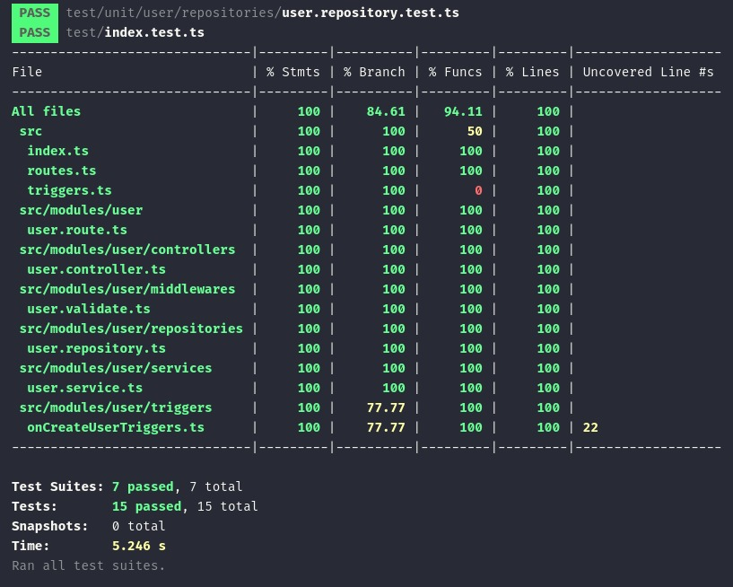
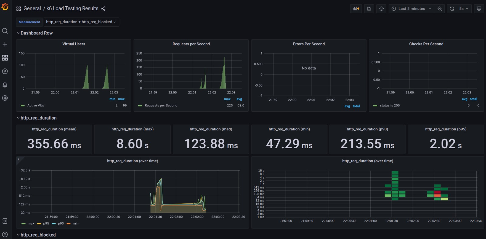

# Superfrete Function

Este é projeto é uma aplicação de backend utilizando Firebase Functions, TypeScript, Express e Firestore.

## Como rodar

1. Certifique-se de ter o firebase emulator instalado e configurado. Caso não tenha, confira a documentação: https://firebase.google.com/docs/emulator-suite/install_and_configure?hl=pt
2. Faça o clone deste repositório em sua máquina local.
3. Navegue até o diretório `cd superfrete-function/functions`
4. Instale as dependências do projeto: `npm install`.
5. Faça o build no projeto com `npm run build` ou `npm run build:watch`
6. Por fim, execute um `firebase emulators:start` para iniciar o ambiente simulado do firebase.
7. O Firebase Emulator Suite pode ser acesso em `http://localhost:4000`.

## Documentação da API

Para o caso deste teste em específico, tomei a decisão de utilizar o postman para documentar os endpoints ao invés do swagger, devido ao fato de o swagger não ser muito utilizado para casos de aplicações serveless. O link do postman se encontra abaixo:

``` curl
https://www.postman.com/fabjordan/workspace/superfrete/request/5505257-aebd4602-0750-44fe-9f8d-4517e94d6458
```

## Arquitetura do Projeto

O projeto Superfrete Function é uma aplicação backend construída utilizando Firebase Functions, TypeScript, Express, e Firestore. A arquitetura do projeto foi projetada para ser modular e escalável, facilitando a manutenção e a adição de novas funcionalidades.

### 1 - Arquitetura em Camadas (Layered Architecture):
O código está organizado em camadas distintas: Controlador (Controller), Serviço (Service) e Repositório (Repository). Isso ajuda a separar as responsabilidades e facilita a manutenção e a escalabilidade do código.

- Controller: Lida com a lógica de recebimento de requisições HTTP e envio de respostas.
- Service: Contém a lógica de negócios e regras de aplicação.
- Repository: Responsável pela interação com o banco de dados.
- Interfaces: Define os tipos de dados e contratos para objetos.
- Middlewares: Funções que interceptam as requisições HTTP e executam lógica adicional (Neste caso, validações).
- Triggers: Funções executadas em resposta a eventos do Firebase Firestore.
- Route: Define as rotas de cada móduilo da API e vincula os controladores a elas.

### 2 - Princípio da Responsabilidade Única (Single Responsibility Principle):
- Cada classe tem uma responsabilidade única e bem definida. O UserController lida apenas com requisições HTTP, o UserService com a lógica de negócios e o UserRepository com a persistência de dados.

### 3- Injeção de Dependência (Dependency Injection):
- As dependências são injetadas nos construtores das classes. Por exemplo, UserController recebe UserService e UserService recebe UserRepository. Isso facilita a substituição de dependências para testes ou mudanças futuras.

### 4 - Modularidade:
- O projeto está dividido em módulos (user), o que facilita a expansão e manutenção. Cada módulo contém suas próprias definições de controller, service e repository.

### 5 - Interface Segregation Principle (ISP):
- A interface User define um contrato claro para o objeto User, o que torna o código mais robusto e facilita a validação.

### 6 - Uso de Tipos (Type Safety):
- Utiliza-se interfaces para definir os tipos de dados, o que é uma boa prática para garantir a consistência e a segurança dos tipos no TypeScript.


## Qualidade

### Testes
O projeto contém unitários e de integração construidos com a ferramenta JEST.

<b>Unitários</b>: Testes unitários são escritos para cada camada do projeto utilizando Jest, garantindo que cada unidade de código funcione conforme esperado isoladamente.

<b>Integração</b>: Testes de integração são usados para garantir que diferentes partes do sistema funcionem bem juntas, especialmente as rotas que interagem com os controllers e serviços.

<b>Cobertura de Código</b>: o Jest foi configurado para gerar relatórios de cobertura de código, ajudando a identificar partes do código que não estão cobertas por testes.

Para executar os testes no projeto, basta executar:

``` shell
npm run test
```

Resultado:



### Qualidade estática de código
Este projeto utiliza o SonarCloud para realizar a análise estática de código, afim de obter insights detalhados sobre a qualidade do código, incluindo detecção de bugs, vulnerabilidades de segurança, code smells, e problemas de manutenção.

O dashboard pode ser acessado em:
```
https://sonarcloud.io/project/overview?id=fabjordan_firebase-functions
```

## Bônus

### Performance
Para realizar testes de performance, foi preparado um setup para testes de carga utilizando a ferramenta grafana k6.

O setup consiste na utilização das seguintes ferramentas:
- K6: estrutura que realiza os testes de carga
- Grafana: apresentação do resultado dos testes
- InfluxDB: banco de dados onde são armazenados as estatísticas dos testes

Para realizar testes de carga, acesse a pasta k6 e levante os serviços com o docker-compose:

``` shell
cd k6
docker compose up -d influxdb grafana
```
Com o grafana e o influxdb prontos para receberem os dados, finalmente execute o teste de carga com:

``` shell
docker compose run k6 run /scripts/ewoks.js
```

Para acompanhar o resultado em tempo real dos testes, acesse:

 ```
http://localhost:3000/d/k6/k6-load-testing-results
```

Resultado:




### Importante

Devido a configuração do docker, não é possível realizar testes em endpoints rodando em localhost. Aconselho usar alguma ferramenta como [ngrok](https://ngrok.com/) para gerar um tunel http.
Após isso, basta alterar a constante <b>url</b> em /k6/scripts/ewoks.js

> Para modificar a quantidade de VU's do teste, basta alterar a propriedade <b>target</b> em <b>stages</b>

### Possíveis melhorias

Algumas praticas que podem ser adotadas em projetos similares a este são:

#### Melhorias de performance
- Caching: Implementar estratégias de caching, usando ferramentas como o Redis para armazenar dados frequentemente acessados e reduzir a carga no Firestore.

- Otimização de Consultas: Revisar e otimizar as consultas ao Firestore para garantir que sejam eficientes. Isso pode incluir o uso de índices apropriados e a minimização de leituras desnecessárias.

- Monitoramento de Performance: Integrar com ferramentas como Firebase Performance Monitoring, Datadog ou qualquer outra a depender da preferência, para rastrear o desempenho da aplicação em tempo real e identificar gargalos.

#### Segurança
- Autenticação e Autorização: Integrar com os serviços de autenticação como Firebase Authentication e implementar controles de autorização detalhados para garantir que os usuários só possam acessar os dados e funcionalidades que lhes são permitidos.

- Recursos de proteção: rating limiting, proteção contra ataques DDoS (Cloudflare) e outros.

#### Qualidade do Código
- Linting e Formatação: Assegurar que todos os arquivos TypeScript e JavaScript estejam sujeitos a linting rigoroso e formatação consistente usando ESLint, Prettier e etc.

- Pipelines de CI/CD: Construir pipelines robustas voltadas a execução de testes, análise estática de código e building.

#### Documentação
- Documentação Automatizada: Implementar o Swagger ou uma ferramenta similar para gerar documentação de API automaticamente. Isso facilita na realização de testes de Q.A, integração com outras aplicações e a manutenção da API.

## Licença
Este projeto é licenciado sob a licença MIT.